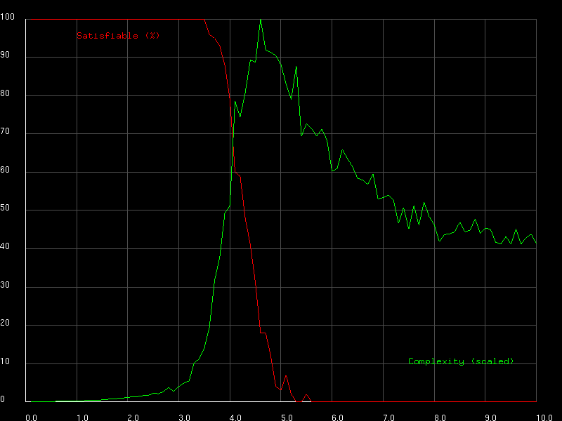

# SAT DPLL Solver

A small program for investigating the phase shift in k-SAT problems.

## Features

- k-SAT instances generator
- DPLL solver for k-SAT instances
- OpenGL plotting of the phase shift

### Phase Transitions in k-SAT

The k-SAT problem is known to exhibit a phase transition based on the ratio of clauses to variables. At a critical threshold, the probability of satisfiability shifts dramatically. This project explores this phenomenon by generating random instances and analyzing the results.
Example Phase Transition Thresholds:
|k|Critical Ratio (Clauses/Variables)|
|-|----------------------------------|
|3|~4.26|
|4|~9.93|
|5|~21.12|

## Installation
### Dependencies
- `OpenGL`
- `GLUT`

### With Nix
```shell
nix build
```

### With Make
```shell
make
```

## Usage

```shell
./satps
```



Note: the parameters of the program are hardcoded
```C
#define VARIABLES_COUNT 50
#define SAT_K 3
#define MAX_CLAUSES 500
#define ALPHA_STEPS 100
#define NUM_INSTANCES 100
```

## Contributing

Contributions are welcome! Before submitting a pull request, please:
- Format your code with `clang-format`
- Test your code for memory leaks and undefined behavior with `valgrind`
